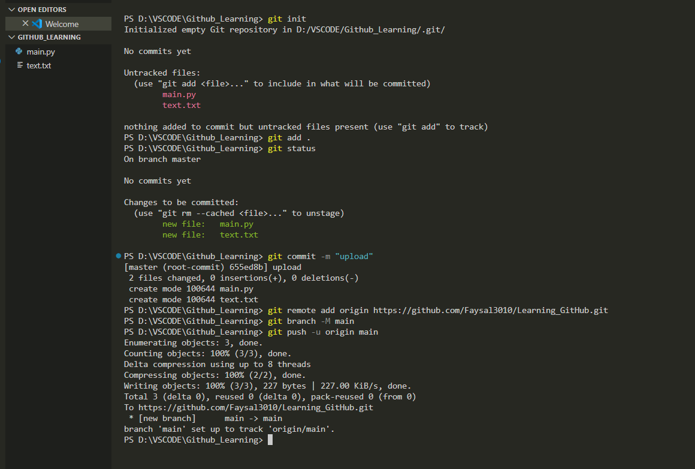

# Learn Git & GitHub:


A step-by-step guide to mastering Git and GitHub — version control, collaboration, and confidence, all in one place!

---

## 📚 Table of Contents

1. [Introduction](#introduction)
2. [Git vs GitHub](#git-vs-github)
3. [Core Concepts](#core-concepts)
4. [Essential Git Commands](#essential-git-commands)
5. [Real-Life Git Workflow](#real-life-git-workflow)
6. [Common Problems & Fixes](#common-problems--fixes)
7. [Branching & Merging](#branching--merging)
8. [GitHub Connection (SSH/HTTPS)](#github-connection-sshhttps)
9. [Conflict Resolution](#conflict-resolution)
10. [Git Stash](#git-stash)
11. [Useful Tips & Tricks](#useful-tips--tricks)
12. [Practice Ideas](#practice-ideas)

---

## 🧠 Introduction

**Git** = A version control system that helps track changes in code. **GitHub** = A cloud platform to host and collaborate on Git repositories.

---


## 🔍 Git vs GitHub

| Tool   | Purpose                      |
| ------ | ---------------------------- |
| Git    | Local version control        |
| GitHub | Remote Git repo host (cloud) |

---

## 🧱 Core Concepts

| Term   | Description                                 |
| ------ | ------------------------------------------- |
| Repo   | A project's directory with version tracking |
| Commit | A snapshot of your code                     |
| Branch | A separate version of your project          |
| Merge  | Combine changes from one branch to another  |
| Remote | The version of the repo on GitHub           |

---

## 🛠 Essential Git Commands


```bash
# Initialize Git in a folder
git init

# Check current status
git status

# Add files to stage
git add filename.py
# Or add everything
git add .

# Save changes
git commit -m "Initial commit"

# Connect local repo to GitHub
git remote add origin https://github.com/yourname/repo.git

# Push changes
git push -u origin main
```


---

## 🔄 Real-Life Git Workflow

```bash
# Step 1: Init
mkdir my-project && cd my-project
git init

# Step 2: Write code & test
```


```
# Step 3: Add & commit
git add .
git commit -m "First version"

# Step 4: Create repo on GitHub (empty)

# Step 5: Connect & push

# Set branch
git branch -M main
git remote add origin https://github.com/yourname/repo.git
git push -u origin main
```


---

## 🚧 Common Problems & Fixes

| Problem                 | Fix                                      |
| ----------------------- | ---------------------------------------- |
| Wrong file pushed       | `git reset --soft HEAD~1`                |
| Merge conflict          | Manually resolve → `git add . && commit` |
| Diverged error          | `git pull --rebase origin main`          |
| Username/email not set  | `git config user.name/email`             |
| Can't push (no commits) | Make initial commit first                |

---

## 🌿 Branching & Merging

```bash
# Create branch
git branch feature-x

# Switch branch
git switch feature-x

# Merge to main
git switch main
git merge feature-x

# Delete branch
git branch -d feature-x
```


---

## 🔐 GitHub Connection (SSH/HTTPS)

**SSH (Recommended for advanced users):**

1. Generate key:

```bash
ssh-keygen -t ed25519 -C "your_email@example.com"
```

2. Add to GitHub → Settings → SSH Keys
3. Use SSH URL:

```bash
git@github.com:yourname/repo.git
```

**HTTPS (Easy to start):**

```bash
git remote add origin https://github.com/yourname/repo.git
```

---

## ❗ Conflict Resolution

```bash
# When conflict happens, fix the file
# You'll see this format in code:
<<<<<<< HEAD
Local version
=======
Remote version
>>>>>>> origin/main

# Decide & edit → then:
git add .
git commit -m "Resolved conflict"
```

---

## 📦 Git Stash

```bash
# Temporarily save changes
git stash

# See stash list
git stash list

# Apply latest stash
git stash pop
```

---





## 💡 Useful Tips & Tricks

### secret dev key


```bash
# Check version
git --version

# Who you are
git config --get user.name
git config --get user.email

# Log commits
git log
# One line view
git log --oneline

# View all branches
git branch -a

# Reset to previous commit
git reset --hard <commit_id>

# Delete file from Git
# Untrack but keep
git rm --cached filename
# Remove completely
git rm filename
```

---

## 🧪 Practice Ideas

✅ Track a small Python project with Git ✅ Create a GitHub repo and upload step-by-step ✅ Try commands: `git log`, `git diff`, `git branch` ✅ Solve a conflict manually using VS Code ✅ Create & delete branches ✅ Use `.gitignore` to skip files like `.env`, `.venv/`

---

